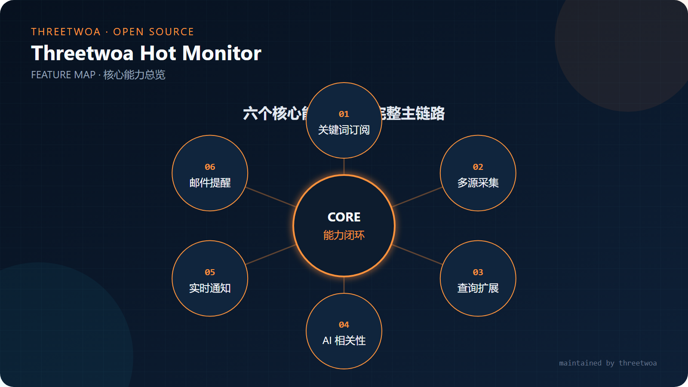
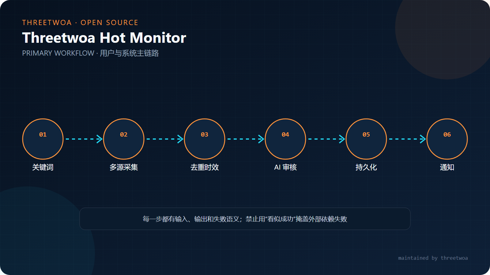
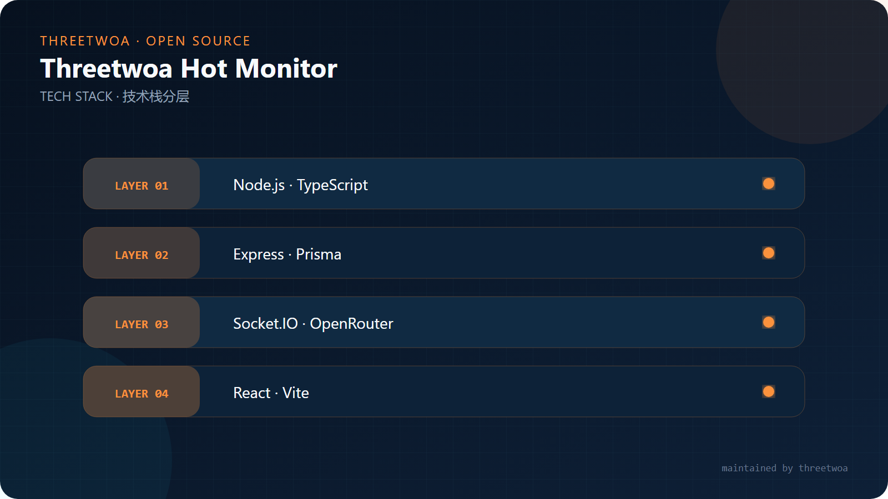
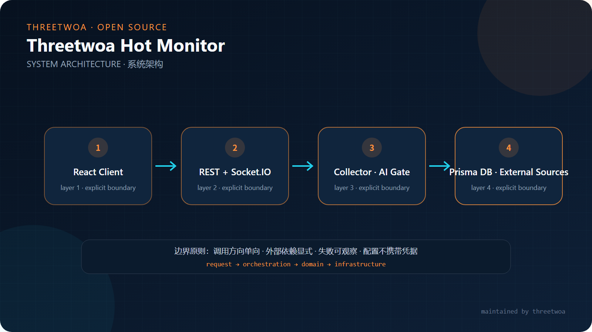
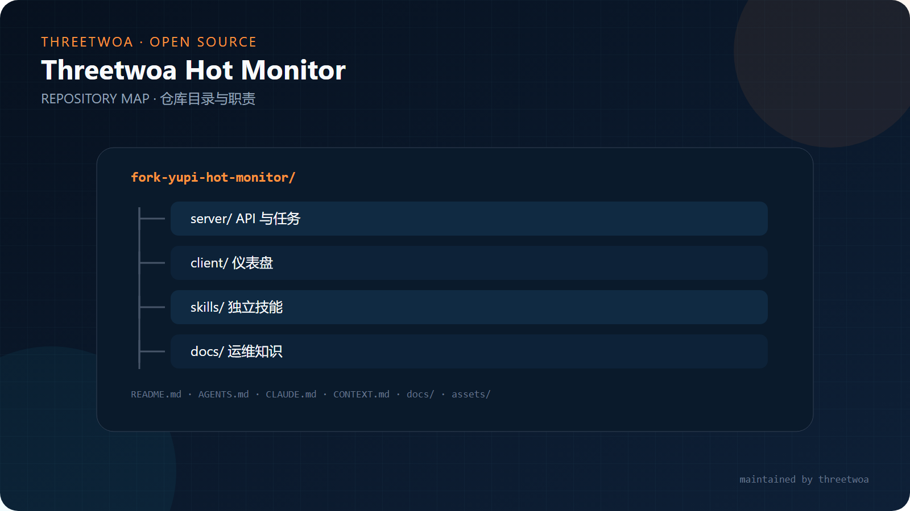

<p align="center">
  <h1 align="center">Threetwoa Hot Monitor</h1>
  <p align="center"><em>把分散的信息流变成可订阅、可解释的热点信号</em></p>
  <p align="center">面向内容研究与趋势追踪的多源热点监控系统：采集国内外平台内容，经时效过滤、AI 相关性审核和优先级排序后，通过实时通知与邮件交付。</p>
</p>

<p align="center"></p>

<p align="center">
  
  
  
</p>

<p align="center"><a href="#功能">功能</a> · <a href="#快速开始">快速开始</a> · <a href="#preview">Preview</a> · <a href="#showcase">Showcase</a> · <a href="#架构">架构</a> · <a href="#key-docs">Key docs</a></p>

---

## 为什么需要热点监控

人工刷新多个平台既慢又容易漏掉真正相关的信号。本系统以关键词为中心聚合来源，并明确区分“提到关键词”和“只是同领域内容”。当前边界：它是研究和辅助判断工具，不对信息真实性作最终背书，也不应绕过目标平台的访问规则。

## 功能

<p align="center"></p>

| 能力 | 说明 |
|---|---|
| 关键词订阅 | 启停监控词，支持 AI 查询扩展与账号识别 |
| 多源采集 | Twitter、微博、Bilibili、搜狗、Bing、Hacker News |
| 信号清洗 | URL 去重、七天时效窗口、来源优先级与处理配额 |
| AI 审核 | 判断真实性、相关度、直接提及、重要性并生成摘要 |
| 实时交付 | Socket.IO 关键词房间和全局通知 |
| 高优提醒 | high / urgent 信号发送邮件 |
| 可降级运行 | 单来源失败不终止整轮采集；AI 未配置时使用保守评分 |

## 主链路

<p align="center"></p>

## 快速开始

```bash
git clone https://github.com/Aafff623/fork-yupi-hot-monitor.git
cd fork-yupi-hot-monitor

cd server
npm install
npm run dev
```

另开终端：

```bash
cd client
npm install
npm run dev
```

服务端环境变量与数据库初始化见 docs/LOCAL_SETUP.md。OPENROUTER_API_KEY 未配置时系统会进入保守降级模式。

## 处理链路

```text
Active Keywords → Account Detection → Query Expansion
  → Multi-source Search → Deduplicate → Freshness Filter
  → AI Relevance Gate → Persist → WebSocket / Email
```

## 技术栈

<p align="center"></p>

## 架构

<p align="center"></p>

```text
React Client ← REST + Socket.IO → Express Server
                                  ├─ Prisma Database
                                  ├─ Search Adapters
                                  ├─ AI Analysis
                                  └─ Scheduled Checker
```

## 模块

<p align="center"></p>

| 路径 | 职责 |
|---|---|
| client/src | 仪表盘、筛选排序、API 与实时连接 |
| server/src/routes | 关键词、热点、通知与设置 API |
| server/src/jobs/hotspotChecker.ts | 核心采集和筛选编排 |
| server/src/services | 搜索平台、AI、邮件适配器 |
| server/prisma | 数据模型与本地数据库 |
| skills/hot-monitor | 可独立调用的热点搜索技能 |

## 阅读顺序

1. server/src/types.ts
2. server/src/jobs/hotspotChecker.ts
3. server/src/services/ai.ts
4. server/src/services/search.ts 与 chinaSearch.ts
5. server/src/routes
6. client/src/services 与 App.tsx

## 视觉画册

点击缩略图可查看原始矢量图：

| | |
|:---:|:---:|
| [](assets/images/readme/features.svg)<br>**Features** · 核心能力 | [](assets/images/readme/architecture.svg)<br>**Architecture** · 系统边界 |
| [](assets/images/readme/tech-stack.svg)<br>**Tech Stack** · 技术分层 | [](assets/images/readme/workflow.svg)<br>**Workflow** · 主链路 |
| [](assets/images/readme/structure.svg)<br>**Structure** · 仓库地图 | |


## Preview

本仓为单产品应用，**不单独建设 Preview 资产站**（无组件 Gallery / demo 墙）。本地浏览 README 排版请用预览壳：

```bash
python -m http.server 4317
# http://127.0.0.1:4317/preview-readme.html
```

> `preview-shell.png`：本仓声明省略（无 Preview 站可截）。

## Showcase

推荐演示路径（本地联调后按序截图）：

| 步 | 动作 | 期望 |
|---|---|---|
| 1 | 启动 server + client，打开仪表盘 | 列表与关键词侧栏可见 |
| 2 | 新增/启用关键词并触发检查 | 采集流水线跑通；失败源不拖死整轮 |
| 3 | 观察热点卡片与 Socket 通知 | 相关度 / 直接提及 / 重要性可读 |
| 4 | （可选）配置 SMTP 后触发 high/urgent | 邮件送达或日志可见 |

真机截图槽位（待 Playwright；**禁止**文生图伪造 UI）：

| 槽位 | 文件 | 状态 |
|---|---|---|
| 入口 / 主界面 | `assets/images/readme/showcase-01.png` | 占位 |
| 核心流程 | `assets/images/readme/showcase-02.png` | 占位 |
| 结果 / 交付 | `assets/images/readme/showcase-03.png` | 占位 |

## 仓库结构

```text
fork-yupi-hot-monitor/
├── server/                       # Express + Prisma + jobs
├── client/                       # React 仪表盘
├── skills/hot-monitor/           # 可独立调用 Skill
├── docs/agents|adr|glossary|knowledge|outputs/
├── assets/images/readme/
├── AGENTS.md · CLAUDE.md · CONTEXT.md · LANGUAGES.md
└── preview-readme.{html,css,js}  # 端口 4317
```

## Key docs

| 文档 | 说明 |
|---|---|
| [CONTEXT.md](CONTEXT.md) | 领域事实与边界 |
| [LANGUAGES.md](LANGUAGES.md) | 共享用词 |
| [AGENTS.md](AGENTS.md) | Agent 硬约束 |
| [docs/agents/workflow.md](docs/agents/workflow.md) | 任务流 |
| [docs/outputs/prd/readme-diagrams/](docs/outputs/prd/readme-diagrams/) | README 配图 brief / prompts |
| [assets/README.md](assets/README.md) | 媒体约定 |

## 维护者

原作者：**李鱼皮（[liyupi](https://github.com/liyupi)）**。二次开发维护者：[threetwoa](https://github.com/threetwoa)。上游项目为 [liyupi/yupi-hot-monitor](https://github.com/liyupi/yupi-hot-monitor)；外部平台内容与第三方依赖遵循各自条款，仓库许可见 LICENSE。
